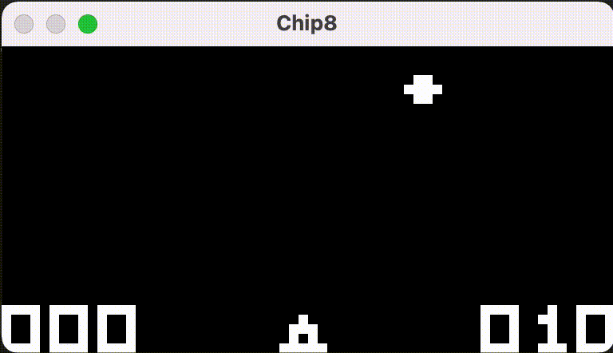
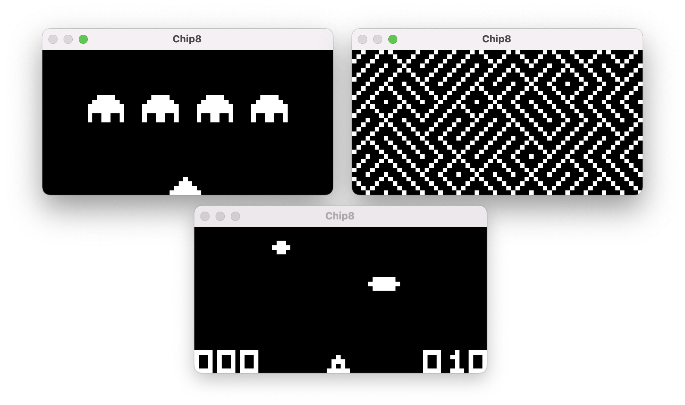

# rs-chip8

A simple emulator of the [Chip-8 virtual machine](https://en.wikipedia.org/wiki/CHIP-8), written in Rust.



## Running it

The project can be built just like any other cargo project.
Tested with rust version >= `1.57.0`.

You can run one of the included (e.g. `UFO`) games like so:

```shell
cargo run games/UFO
```

Chip-8 uses a 16-key keypad for inputs, the keys are mapped (in order) to the following keyboard keys:

<kbd>1</kbd> <kbd>2</kbd> <kbd>3</kbd> <kbd>4</kbd> </br>
<kbd>q</kbd> <kbd>w</kbd> <kbd>e</kbd> <kbd>r</kbd> </br>
<kbd>a</kbd> <kbd>s</kbd> <kbd>d</kbd> <kbd>f</kbd> </br>
<kbd>z</kbd> <kbd>x</kbd> <kbd>c</kbd> <kbd>v</kbd> </br>

## Screenshots


